# 로그 오류 분석 및 LLM 리포트 시스템 설계

현재 0.5.0 폐쇄망 배포는 RHEL 8.2 x86_64 / glibc 2.28 / Python 3.11.8 기준이며,
`src/log_analyzer`를 직접 수정해 실행합니다. 최신 배포·수정 절차는
[폐쇄망 소스 수정 안내](docs/OFFLINE_DEVELOPMENT.md)를 따릅니다.

- 상태: MVP 및 Git ref fallback 구현 완료, Rocky Linux VM·실제 Elasticsearch 통합 테스트 통과 (OpenAI 실연동·systemd 운영 검증 대기)
- 작성일: 2026-09-04
- 최종 현행화: 2026-09-05
- 대상 환경: Red Hat Enterprise Linux 9 / Python 3.11.8
- 1차 분석 대상: Java 애플리케이션 오류 및 스택 트레이스
- 저장소: git@github.com:lahuman/logAnalysis.git

중요망 배포는 `codex/important-network`에서 준비하며 Python 3.11.8·의존성·로컬 Git을
동봉한 RHEL 9 x86_64 압축파일을 사용한다. `provider=onprem`은 명시된 내부 Chat
Completions 서버에 연결하고, 사설 CA와 선택적 인증을 지원한다. 중요망 실행기는
클라우드 provider를 거부하며 프록시 환경 변수를 제거한다. 구체적인 설치·실행·교체
절차는 [중요망 배포 안내](docs/OFFLINE_DEPLOYMENT.md)를 따른다.

이 문서는 현재 구현과 후속 검증 기준을 함께 기록한다. 실행 결과와 남은 검증의
상세 근거는 [검증 현황](docs/VALIDATION_STATUS.md)을 참고한다.
NVIDIA NIM Chat Completions 어댑터와 LLM smoke 도구를 추가했고, Nemotron 3 Super로
합성 Java 오류의 실제 분석·검증·리포트 생성에 성공했다. 상세 설정·검증은
[NIM 연동](docs/NVIDIA_NIM.md)을 따른다.

## 1. 목적

운영 로그 저장소에서 오류를 주기적으로 조회하고, 오류가 발생한 소스 코드 위치를 찾아 관련 코드와 로그를 OpenAI 모델에 전달한 뒤, 근거가 포함된 분석 및 해결 리포트를 생성한다.

초기 오류 저장소는 Elasticsearch지만 핵심 로직은 이에 종속되지 않는다. 중요망 브랜치 0.3.0에서는 Oracle SQL 어댑터를 추가했다. PostgreSQL, MySQL, REST API는 후속 요구에 따라 확장할 수 있다.

## 2. 핵심 설계 결정

1. 오류 원본은 `ErrorSource` 인터페이스 뒤에 격리한다.
2. 저장소별 응답을 공통 `ErrorEvent`로 변환한다.
3. `ErrorParser`가 언어별 로그를 공통 `ParsedError`로 변환한다.
4. 초기에는 Java 파서와 실패하지 않는 범용 파서만 구현한다.
5. 오류 이벤트마다 LLM을 호출하지 않고 Fingerprint로 그룹화한다.
6. `git.commit.id`가 있으면 배포 commit을 분석하고, 없으면 설정된 Git ref를 실행 시점 SHA로 고정해 분석한다.
7. OpenAI Python SDK와 범용 LLM 프레임워크를 사용하지 않는다.
8. OpenAI Responses API를 `httpx`로 직접 호출한다.
   NVIDIA NIM은 같은 HTTP·검증 정책을 공유하고 Chat Completions 형식으로 호출한다.
9. LLM 응답은 JSON Schema 기반 구조화 결과로 받는다.
10. Markdown 리포트는 검증된 JSON을 애플리케이션이 렌더링한다.
11. LLM은 코드 수정, 명령 실행, PR 생성 또는 배포를 수행하지 않는다.
12. 초기 버전은 단일 RHEL 서버에서 systemd timer로 실행한다.

## 3. 범위

초기 범위:

- 오류 저장소 증분 조회, 정규화 및 중복 제거
- Java 및 범용 로그 파싱과 Git revision 기반 소스 조회
- 비밀정보 제거와 OpenAI Responses API 호출
- 구조화 응답 검증, SQLite 상태 저장 및 Markdown 리포트
- systemd 기반 주기 실행

초기 제외 범위:

- 코드 자동 수정, PR 및 배포
- 멀티 에이전트와 자동 다중 LLM 라우팅(OpenAI/NIM 단일 공급자 선택은 지원)
- 벡터 DB, Kafka, Redis 및 Celery
- 다중 노드, 사용자 관리 및 웹 대시보드
- Python, JavaScript, Go 등 추가 언어 전용 파서

## 4. 전체 아키텍처

```mermaid
flowchart LR
    Timer[systemd timer] --> Pipeline[Analysis Pipeline]
    Pipeline --> Source[ErrorSource]
    Source --> ES[Elasticsearch Adapter]
    Source -. future .-> SQL[SQL Adapter]
    Source -. future .-> HTTP[HTTP Adapter]
    ES --> Event[Canonical ErrorEvent]
    SQL --> Event
    HTTP --> Event
    Event --> Parse[Language ErrorParser]
    Parse --> Parsed[Canonical ParsedError]
    Parsed --> Normalize[Normalize and Fingerprint]
    Normalize --> Resolve[Source Resolver]
    Resolve --> Git[Read-only Git Repository]
    Git --> Context[Bounded Source Context]
    Context --> Redact[Secret Redaction]
    Redact --> OpenAI[OpenAI Responses API]
    OpenAI --> Validate[Schema and Evidence Validation]
    Validate --> State[SQLite State Store]
    Validate --> Report[Markdown Report]
```



## 5. 주요 컴포넌트

| 컴포넌트 | 책임 |
|---|---|
| AnalysisPipeline | 전체 처리 순서 및 오류 상태 관리 |
| ErrorSource | 외부 오류 저장소의 페이지 단위 조회 |
| ErrorParser | 언어별 로그를 공통 오류와 스택 프레임으로 변환 |
| `make_fingerprint` | 오류 그룹화 및 중복 LLM 호출 방지 |
| `GitSourceResolver` | 서비스와 Git commit/ref를 고정된 source revision에 연결 |
| SecretRedactor | 비밀정보와 개인정보 제거 |
| OpenAIResponsesAnalyzer | OpenAI HTTP 요청과 응답 변환 |
| NvidiaNimAnalyzer | NVIDIA NIM Chat Completions 요청·출력 모드·응답 변환 |
| `AnalysisResult` / `validated_evidence` | Pydantic 응답 스키마와 파일·라인 근거 검증 |
| SQLiteStateStore | 체크포인트, 작업 상태 및 결과 저장 |
| ReportWriter | 검증 결과를 Markdown으로 렌더링 |

## 6. 오류 저장소 독립성

아래 타입 예시는 계약의 핵심 필드를 발췌한 것이다. 기본값과 입력 검증을 포함한
실제 정의는 `src/log_analyzer/models.py`와 `sources/base.py`를 따른다.

```python
@dataclass(frozen=True)
class ErrorQuery:
    started_at: datetime
    ended_at: datetime
    severities: tuple[str, ...]
    limit: int = 500


@dataclass(frozen=True)
class ErrorEvent:
    source_name: str
    event_id: str
    occurred_at: datetime
    service: str
    environment: str | None
    version: str | None
    git_commit: str | None
    severity: str
    error_type: str | None
    message: str
    stack_trace: str | None
    raw_log: str | None
    language_hint: str | None
    runtime_hint: str | None
    trace_id: str | None
    attributes: dict[str, object]


@dataclass(frozen=True)
class ErrorPage:
    events: tuple[ErrorEvent, ...]
    next_cursor: str | None


class ErrorSource(Protocol):
    async def fetch(
        self, query: ErrorQuery, cursor: str | None
    ) -> ErrorPage:
        ...

    async def healthcheck(self) -> None:
        ...
```

구현 원칙:

- 저장소 전용 쿼리와 응답 형식은 어댑터 밖으로 노출하지 않는다.
- 어댑터는 필드 매핑만 수행하고 언어별 스택 트레이스를 해석하지 않는다.
- cursor는 구현체만 해석하는 opaque 문자열로 취급한다.
- `(source_name, event_id)`를 idempotency key로 사용한다.
- 분석 상태 저장소와 오류 원본 저장소를 분리한다.
- 오류 저장소는 read-only로 접근한다.

`ElasticsearchErrorSource`, `OracleErrorSource`와 테스트용 `InMemoryErrorSource`를 제공한다.
Oracle은 비동기 Thin 연결의 단일 SELECT 커서를 페이지별로 읽어 `ErrorEvent`로 변환한다.
발생시각·ID 순서, 바인드 변수, UTC 정규화, CLOB 길이 제한을 적용하며 상태·리포트 경로는 공유한다.
연결·매핑과 실제 DB 미검증 범위는 [Oracle 안내](docs/ORACLE.md)를 따른다.

## 7. Elasticsearch 초기 연동

권장 로그 필드:

| 필드 | 용도 |
|---|---|
| `@timestamp` | 증분 조회 기준 |
| `event.id` | 중복 제거 |
| `log.level` | ERROR/FATAL 필터 |
| `service.name` | 저장소 매핑 |
| `service.version` | 배포 버전 식별 |
| `service.environment` | 환경 구분 |
| `error.type` | 예외 유형 |
| `error.message` | 오류 메시지 |
| `error.stack_trace` | 파일 및 라인 추출 |
| `code.filepath`, `code.lineno` | 구조화된 소스 위치 |
| `service.language.name` | 언어 파서 힌트 |
| `service.runtime.name` | 런타임 파서 힌트 |
| `trace.id` | 관련 로그 조회 |
| `git.commit.id` | 정확한 배포 소스 버전 식별(권장, 없으면 설정된 Git ref fallback) |

조회 정책:

- 기본 페이지 크기는 500건이다. 한 실행은 고정 시간 구간의 모든 페이지를 처리한다.
- 최근 60초를 인덱싱 지연 구간으로 제외하며 최초 조회 범위는 60분이다.
- 이전 체크포인트보다 5분 앞선 시각부터 중복 조회한다. 모두 설정으로 조정한다.
- 한 배치 안에서는 PIT와 `search_after`를 사용한다.
- 페이지의 Git/LLM 처리가 길어지는 동안 PIT를 주기적으로 갱신한다.
- 모든 페이지의 작업 상태를 저장한 뒤 조회 종료 시각을 체크포인트로 갱신한다.
  개별 `RETRY_WAIT`·`PERMANENT_FAILURE`가 있어도 전진할 수 있다. 수집·인프라 오류,
  전역 API 계약·인증 오류 또는 실행 중단 시에는 전진하지 않는다.
- PIT cursor는 실행 중에만 유지하며 다음 실행에 재사용하지 않는다.
- 중복 구간 이벤트는 idempotency key로 제거한다.

Java MVP 입력 계약:

- 하나의 예외와 전체 stack trace가 단일 이벤트의 `error.stack_trace` 또는 `message`에 포함돼야 한다.
- Filebeat 등 수집기에서 multiline 결합을 적용하는 것을 우선한다.
- 여러 ES 문서로 분리된 stack trace 재조합은 초기 구현에 포함하지 않는다.
- 불완전한 stack trace는 `parse_warnings`에 기록한다. 남은 프레임에서 소스를
  찾을 수 있을 때만 LLM 분석을 진행하고, 찾지 못하면 `NO_SOURCE`로 종료한다.
- `log.original`은 canonical event, SQLite, 재시도 Context 및 리포트에 복제하지 않는다.
- 필수 mapping 필드가 없는 문서는 정제된 placeholder로 격리하고 영구 실패로 기록한다.

운영 환경에서 multiline 결합을 변경할 수 없다고 확인될 때만 `trace.id + service + 짧은 시간 범위` 기반 재조합을 별도 요구사항으로 추가한다.

## 8. 언어별 오류 파싱

오류 저장소 어댑터는 로그를 가져오는 역할만 맡고, 프로그래밍 언어별 형식 해석은 `ErrorParser`가 담당한다. 이후 단계는 저장소 형식이나 언어 원문을 직접 해석하지 않고 공통 `ParsedError`와 `StackFrame`만 사용한다.

```python
@dataclass(frozen=True)
class StackFrame:
    file_path: str | None
    line_number: int | None
    column_number: int | None
    function_name: str | None
    class_name: str | None
    module_name: str | None
    in_application: bool


@dataclass(frozen=True)
class ParsedError:
    language: str | None
    error_type: str | None
    message: str
    frames: tuple[StackFrame, ...]
    cause_chain: tuple[str, ...]
    parser_name: str
    parse_warnings: tuple[str, ...]


class ErrorParser(Protocol):
    name: str

    def can_parse(self, event: ErrorEvent) -> bool:
        ...

    def parse(self, event: ErrorEvent) -> ParsedError:
        ...
```

파서 선택 순서:

1. 구조화 로그에 파일, 라인 및 함수가 있으면 이를 가장 먼저 사용한다.
2. `language_hint` 또는 서비스 설정에 지정된 언어 파서를 선택한다.
3. 힌트가 없으면 traceback의 안정적인 특징으로 감지한다.
4. 전용 파서가 없거나 파싱에 실패하면 `GenericErrorParser`를 사용한다.
5. 범용 파서는 최소한 메시지를 반환하며 전체 배치를 실패시키지 않는다.

초기 구현:

| 구현체 | 처리 범위 |
|---|---|
| `JavaErrorParser` | exception chain, stack frame, 파일·라인·클래스·메서드 추출 |
| `GenericErrorParser` | 오류 유형과 메시지 보존, 프레임 없이 분석 계속 |

Java 파싱 규칙:

1. 예외 헤더에서 fully qualified exception class와 메시지를 분리한다.
2. `at com.example.OrderService.run(OrderService.java:42)` 형식에서 클래스, 메서드, 파일 및 라인을 추출한다.
3. `Caused by:` 체인을 바깥 예외부터 가장 안쪽 원인까지 보존한다.
4. `Suppressed:`, `... N more`, `Native Method`, `Unknown Source`를 구분한다.
5. Java 9 이상의 `module/class.method` 프레임에서는 module 접두사를 분리한다.
6. inner class, lambda 및 CGLIB 이름의 `$` 이후를 제거해 원본 `.java` 후보를 계산한다.
7. 가장 안쪽 원인의 프레임부터 설정된 애플리케이션 package와 일치하는 첫 프레임을 소스 후보로 선택한다.

소스 경로는 fully qualified class를 `/`로 변환하고 서비스별 `source_roots`와 결합한다. 예를 들어 `com.example.OrderService`는 `src/main/java/com/example/OrderService.java` 후보가 된다. 멀티 모듈 프로젝트는 설정된 source root를 순서대로 검사하고, 후보 파일의 `package` 선언이 프레임과 일치하는지 검증한다.

`ParsedError.error_type`과 `message`는 가장 안쪽 원인을 대표값으로 사용한다. `cause_chain`은 바깥쪽에서 안쪽 순서를 보존하고, `frames`는 `... N more`를 복원한 뒤 가장 안쪽 원인의 프레임부터 배치한다.

언어별 차이는 파서 내부에만 둔다.

| 언어 | 추가 시 고려할 형식 |
|---|---|
| Python | traceback, chained exception |
| JavaScript/TypeScript | 파일·라인·열, async frame, source map |
| Go | goroutine별 stack, panic 원인 |
| .NET | `in File.cs:line`, inner exception |
| C/C++ | 주소 symbolication과 빌드 debug symbol |

파서는 원문을 수정하지 않으며, 파싱 실패 이유는 `parse_warnings`에 남긴다. 정규식은 입력 길이를 제한하고 catastrophic backtracking이 없는 단순 패턴만 사용한다. 실제 운영 로그 fixture가 확보된 언어만 전용 파서를 추가한다.

## 9. 오류 그룹화

LLM 호출 기준은 개별 이벤트가 아니라 오류 그룹이다.

```text
SHA-256(
  service
  + environment
  + parsed_error.error_type
  + normalized(parsed_error.message)
  + parsed_error.top_application_frames
)
```

현재 UUID, 12자리 이상의 16진수, 5자리 이상의 숫자와 공백을 정규화한다.
애플리케이션 프레임은 최대 3개의 클래스·함수·파일·라인을 포함한다. IP를 별도
치환하는 로직은 Fingerprint가 아닌 비밀정보 정제 단계에 있다.

분석 캐시 키는 `fingerprint + resolved_git_commit + model + prompt_version + analyzer_version`이다. 로그에 commit이 없더라도 fallback ref를 해석한 SHA를 `resolved_git_commit`으로 저장해 재시도와 캐시의 소스 identity가 바뀌지 않게 한다. 초기에는 정규식 기반으로 구현하고 품질이 부족할 때만 Drain3를 검토한다.
NIM과 사용자 지정 endpoint에서는 공급자·URL·출력 모드·thinking 설정의 식별자를
내부 `analyzer_version`에 덧붙여 캐시를 구분한다. 설정의 분석기 버전 `1`과 공식
OpenAI의 기존 캐시 식별자는 유지한다.

## 10. 소스 코드 위치 확인

탐색 순서:

1. `ParsedError.frames`에서 구조화 로그 프레임을 우선 확인
2. 그다음 첫 번째 애플리케이션 프레임 선택
3. `java.*`, `jdk.*`와 설정된 framework package 프레임 제외
4. 런타임 경로를 저장소 상대 경로로 변환
5. 이벤트에 `git.commit.id`가 있으면 해당 commit을 선택
6. commit이 없으면 서비스 설정의 `branch`/ref(기본 `HEAD`)를 이벤트의 최초 소스 조회 시점 SHA로 해석하고 작업에 고정
7. 고정된 SHA의 파일과 라인 확인
8. ref fallback인 경우 해당 파일/라인의 `git blame`과 최근 diff/history를 제한된 보조 Context로 수집

작업 트리를 매번 checkout하지 않고 다음 read-only 조회를 사용한다.

```text
git show <resolved-sha>:<repository-relative-path>
```

저장소와 revision, 경로 순회, 절대 경로, 파일 크기, 바이너리 여부 및 라인 범위를 검증한다. 소스를 찾지 못하면 LLM이 경로를 추측하게 하지 않고 `NO_SOURCE`를 기록한다.
이벤트 commit은 로컬 저장소의 heads, remotes 또는 tags 중 하나에서 도달 가능해야 하며, 운영자가 준비한 ref에 없는 dangling object는 거부한다. commit이 없는 경우 설정된 ref를 먼저 SHA로 고정하고 그 SHA를 SQLite 작업 상태에 저장해, 재시도 중 branch가 이동해도 동일 소스를 분석한다.

명시된 이벤트 commit이 잘못됐거나 접근할 수 없으면 ref fallback을 적용하지 않는다.
저장소 자체가 유효하지 않은 경우에는 소스 조회 예외가 발생한다. 애플리케이션은
Git fetch를 수행하지 않으므로 운영자가 로컬 ref와 object를 준비·갱신해야 한다.

ref fallback의 변경 Context는 오류 한 줄에 대한 `git blame --line-porcelain -L N,N`과
해당 파일에 대한 `git log -p --max-count=<diff_history>`로 구성한다. `diff_history`는
기본 5, 최대 50이며 메서드별 이력 추적이나 diff의 원인 순위 산정은 구현하지 않았다.

ref fallback에서 수집한 blame과 최근 diff/history는 배포 revision을 증명하지 않는다.
프롬프트는 이를 정황적 근거로만 사용하도록 지시하고 리포트는 revision 출처를 표시한다.
현재 결과 검증은 파일·라인 범위를 확인하며, 자유 서술의 인과관계까지 자동으로
판정하지는 않는다.

## 11. LLM Context

파일 전체를 보내지 않고 다음 자료만 제한적으로 전달한다.

- 오류 유형, 메시지와 대표 스택 트레이스
- 파싱 경고
- 서비스, 환경, 버전, 고정된 Git SHA와 revision 출처(`event_commit` 또는 `repository_ref`)
- ref fallback인 경우 설정된 Git reference와 제한된 blame·최근 diff/history
- 오류 라인 앞뒤 코드(기본 각 30줄, 설정 예시 각 75줄)
- 스택에서 추출한 함수·클래스 이름과 소스 상대 경로

현재는 단일 Java 파일의 제한된 범위를 사용한다. 함수·클래스 전체 추출, import·관련
테스트 파일 확장 수집, 동일 trace의 추가 로그 조회는 구현하지 않았다. 메서드 경계
추출이 실제 분석 품질을 개선한다는 증거가 생길 때만 Java parser 도입을 검토한다.
요청 모델 상한은 메시지 8,000자, stack trace 30,000자, 소스 100,000자, 변경 Context
30,000자다. 실제 전송 전 기본 redactor가 메시지 4,000자, stack trace 20,000자,
소스 60,000자로 더 줄이며 경고는 최대 20개·각 500자로 제한한다.
`analysis.max_git_change_chars`를 더 크게 설정해도 최종 요청의 변경 Context는
30,000자로 제한된다.

## 12. OpenAI 직접 호출

기본 `provider=openai`의 계약이다. `provider=nvidia_nim`을 선택하면
`POST /chat/completions`와 `messages`, `response_format` 또는 `guided_json`을 사용한다.
NIM은 `choices[0].message.content`에서 결과를 읽으며 Responses 전용 필드는 전송하지
않는다. 두 공급자는 정제·응답 스키마·파일/라인 검증을 공유한다.

원칙:

- OpenAI Python SDK를 사용하지 않는다.
- `httpx.AsyncClient`로 `POST /v1/responses`를 호출한다.
- API URL과 모델명은 TOML에서, API 키는 환경 변수 또는 systemd credential에서 읽는다.
- 한 오류 그룹당 독립된 stateless 요청을 사용한다.
- 요청에 `store: false`를 지정한다.
- JSON Schema 기반 Structured Outputs를 사용한다.

```python
class IncidentAnalyzer(Protocol):
    async def analyze(
        self, request: AnalysisRequest
    ) -> AnalysisResult:
        ...
```

구현체는 `OpenAIResponsesAnalyzer`, `NvidiaNimAnalyzer`, `OnPremAnalyzer`와 테스트용
`FakeIncidentAnalyzer`를 둔다. onprem은 NIM과 Chat Completions 응답 검증을 공유한다.

```json
{
  "model": "OPENAI_MODEL 환경 변수 값",
  "store": false,
  "instructions": "고정된 시스템 분석 지시",
  "input": "정제된 오류 및 소스 Context JSON",
  "max_output_tokens": 3000,
  "text": {
    "format": {
      "type": "json_schema",
      "name": "incident_analysis",
      "strict": true,
      "schema": {}
    }
  }
}
```

시스템 지시는 로그와 소스가 신뢰할 수 없는 분석 데이터이며, 그 안의 명령을 따르지 않고 제공된 증거만 사용하도록 명시한다. 확인할 수 없는 내용은 `unknowns`에 기록하고 코드나 시스템을 직접 변경하지 못하게 한다.

## 13. 분석 응답과 검증

응답의 최소 형태:

```json
{
  "summary": "오류 요약",
  "root_causes": [
    {
      "cause": "추정 원인",
      "confidence": 0.85,
      "evidence": [
        {
          "file": "src/main/java/com/example/order/OrderService.java",
          "line": 142,
          "description": "null 검사 없이 메서드 호출"
        }
      ]
    }
  ],
  "recommended_fixes": [
    {
      "description": "수정 방법",
      "files": ["src/main/java/com/example/order/OrderService.java"],
      "risk": "low"
    }
  ],
  "validation_steps": ["재현 테스트", "회귀 테스트"],
  "unknowns": []
}
```

응답 처리:

- `output`에서 `type=message` 항목을 찾는다.
- message의 `content`에서 `type=output_text`를 추출한다.
- 첫 번째 output 항목이 최종 답변이라고 가정하지 않는다.
- JSON을 Pydantic 모델로 검증한다.
- 파일과 라인이 실제 Context 범위에 있는지 다시 확인한다.
- Context 밖의 근거 경로·라인과 권장 수정 파일은 목록에서 제외한다. 원인·수정
  설명 자체는 유지되므로 근거 목록이 빈 결과가 있을 수 있다. 함수명과 자유 서술의
  사실성은 별도 자동 검증 대상이 아니다.

재시도 정책:

| 상황 | 처리 |
|---|---|
| 연결 실패 및 timeout | 재시도 |
| HTTP 429 | Retry-After 반영 후 재시도 |
| HTTP 500/502/503/504 | 지수 backoff와 jitter로 재시도 |
| HTTP 400 | 모델·요청 계약 오류로 배치를 중단하고 checkpoint를 전진하지 않음 |
| HTTP 401/403 | 인증·권한 오류로 배치를 중단하고 checkpoint를 전진하지 않음 |
| JSON 검증 실패 | 한 번만 수정 요청 |
| 응답 누락 또는 구조화 응답 복구 실패 | `InvalidResponseError`, 작업은 `PERMANENT_FAILURE` |

각 HTTP 요청은 최초 시도를 포함해 최대 3회 시도한다. JSON 스키마 복구 요청은
최대 한 번이며 별도의 HTTP 시도 제한을 적용한다. 일시 오류가 남으면 정제된
요청을 SQLite에 저장해 다음 실행에서 재시도한다. 실행 간 실패 누적은 기본
5번째에 `PERMANENT_FAILURE`로 전환하며, 지연은 60초부터 지수 증가해 최대
3,600초로 제한한다. 별도 재시도 라이브러리는 사용하지 않는다.

## 14. 데이터 제거 및 보안

LLM 전송 전에 알려진 API 키·토큰·Authorization·비밀번호·개인키·쿠키 등의 패턴과
이메일·IP 등 일부 개인정보를 마스킹하고 payload 크기를 제한한다. 임의의 고객 데이터
전체를 자동 식별하는 기능은 없으므로 실제 전송 허용 범위는 운영 도입 전에 확인한다.

보안 원칙:

- 오류 저장소는 read-only 계정 사용
- Git 저장소는 read-only deploy key 사용
- OpenAI API 키를 저장소에 커밋하지 않음
- TLS 인증서 검증 비활성화 금지
- LLM에 파일 시스템, 셸 또는 DB 도구를 제공하지 않음
- 원본 로그를 저장하지 않으며 Source Context 접근 감사 정책은 운영 환경에서 별도 확정
- 리포트 보존 및 삭제 정책 설정
- 전용 OS 사용자로 실행하고 root 실행 금지

### 위협 모델과 통제

| 위협 | 신뢰 경계 | 통제 |
|---|---|---|
| 경로 순회·임의 파일 읽기 | 로그 → Git 소스 조회 | commit/ref 형식, 저장소 상대 `source_roots`, package 선언, 파일 크기와 라인 범위를 검증하고 Git subprocess 인자를 배열로 전달 |
| 잘못된 배포 소스 분석 | 로그 메타데이터 → Git revision | `git.commit.id`가 있으면 이를 우선하고, 없을 때만 설정 ref를 SHA로 고정한다. 선택한 revision에서 소스 위치를 찾지 못하면 `NO_SOURCE`로 종료한다. ref fallback의 blame/diff는 배포 사실이나 인과관계의 증명이 아니므로 프롬프트에서 제한하고 리포트에 출처를 표시한다. |
| Prompt injection | 로그·소스 → LLM | 로그와 소스를 비신뢰 데이터로 명시하고 도구를 제공하지 않으며, 구조화 응답의 파일·라인 근거를 Context 범위와 재검증 |
| 비밀정보·개인정보 유출 | 운영 데이터 → 외부 API·SQLite·리포트 | 전송 전 redaction, Context 상한, 원본 로그 비저장, 재시도에는 정제된 요청만 저장, API 키는 환경변수/systemd credential로만 주입 |
| 중복 실행·상태 손상 | timer·수동 실행 → SQLite | POSIX `flock`을 프로세스 수명 동안 유지하고 checkpoint는 고정 snapshot의 마지막 페이지 처리 후에만 갱신 |

## 15. 상태 및 저장소

초기 상태 저장소는 Python 표준 라이브러리 `sqlite3`를 사용한다.

```text
DISCOVERED
  -> PARSED
  -> SOURCE_RESOLVED
  -> ANALYZING
  -> COMPLETED
```

운영 상태:

```text
NO_SOURCE
RETRY_WAIT
PERMANENT_FAILURE
```

실제 SQLite 테이블:

| 테이블 | 내용 |
|---|---|
| `schema_meta` | 스키마 버전 |
| `collection_checkpoint` | 수집 소스별 마지막 조회 종료 시각 |
| `analysis_job` | 이벤트 참조, fingerprint, 고정 SHA, 상태, 정제된 재시도 요청, 리포트 경로 |
| `analysis_cache` | fingerprint·SHA·모델·프롬프트·분석기 버전별 검증 결과 |
| `report_cleanup_queue` | 참조가 사라진 리포트의 삭제 재시도 |

별도 원본 로그·소스 스냅샷·incident 테이블은 만들지 않는다. 발생 횟수는 작업
레코드에서 계산한다. 종료 상태가 되면 재시도 요청을 비우며, 정상적으로 수집
체크포인트를 저장한 실행에서 보존 정리를 수행한다. 기본 보존 기간은 30일이다.

외부 오류 저장소를 변경해도 기존 분석 이력과 리포트는 유지돼야 한다.

## 16. 리포트

리포트에는 다음 내용을 포함한다.

1. 오류 요약
2. 서비스, 환경 및 배포 버전
3. 최초/최근 발생 시각과 발생 횟수
4. 대표 스택 트레이스
5. 확인된 소스 위치
6. 근거가 있는 추정 원인
7. 권장 수정 방법과 위험
8. 검증 및 회귀 테스트 방법
9. 불확실한 부분
10. 모델, 프롬프트 버전 및 분석 시각
11. 분석한 Git SHA, revision 출처, fallback reference와 변경 Context

LLM이 Markdown 전체를 만들지 않고 검증된 `AnalysisResult`를 템플릿에 적용한다.
현재 리포트는 이벤트별 파일이다. 발생 횟수는 작성 시점의 같은 fingerprint·SHA
작업 수이고, `First seen`·`Last seen`에는 해당 이벤트의 발생 시각을 넣는다.
그룹 전체의 최초·최근 시각 집계나 이미 작성한 리포트의 실시간 갱신은 구현하지 않았다.

## 17. 의존성

```toml
dependencies = [
    "aiohttp>=3.9,<4",
    "elasticsearch>=8,<9",
    "httpx>=0.27,<1",
    "pydantic>=2,<3"
]
```

표준 라이브러리 사용 영역:

- `sqlite3`: 상태 저장
- `re`: 파싱과 마스킹
- `hashlib`: Fingerprint와 무결성
- `pathlib`: 안전한 경로 처리
- `subprocess`: read-only Git 명령
- `asyncio`: 제한된 동시 처리
- `tomllib`: 설정
- `json` / `sys.stderr`: CLI 구조화 JSON 운영 로그

## 18. 프로젝트 구조

```text
logAnalysis/
├── pyproject.toml
├── Dockerfile.test
├── compose.yaml
├── SYSTEM_DESIGN.md
├── docs/
│   ├── WSL_DOCKER_TESTING.md
│   └── VALIDATION_STATUS.md
├── templates/
│   └── report.md
├── config/
│   └── config.toml.example
├── src/log_analyzer/
│   ├── models.py
│   ├── errors.py
│   ├── config.py
│   ├── run_lock.py
│   ├── pipeline.py
│   ├── sources/
│   │   ├── base.py
│   │   ├── memory.py
│   │   └── elasticsearch.py
│   ├── parsers/
│   │   ├── selection.py
│   │   ├── java.py
│   │   └── generic.py
│   ├── source_code/
│   │   └── git.py
│   ├── analysis/
│   │   ├── redact.py
│   │   ├── openai_responses.py
│   │   └── models.py
│   ├── storage.py
│   ├── report.py
│   └── cli.py
├── tests/
│   ├── fixtures/
│   ├── integration/test_elasticsearch_live.py
│   ├── test_pipeline.py
│   ├── test_java_parser.py
│   ├── test_generic_parser.py
│   ├── test_redact.py
│   ├── test_openai_responses.py
│   └── test_elasticsearch_source.py
└── deploy/
    ├── log-analyzer.service
    ├── log-analyzer.timer
    ├── credentials.conf.example
    └── hourly-schedule.conf.example
```

교체 가능성이 실제로 필요한 오류 저장소와 OpenAI 호출만 격리한다. 일회성 코드를 위한 추가 repository, factory 및 service 계층은 만들지 않는다.

## 19. RHEL 배치 구조

```text
/opt/log-analyzer/                 애플리케이션과 Python venv
/etc/log-analyzer/config.toml      일반 설정
/var/lib/log-analyzer/state.db     분석 상태
/var/lib/log-analyzer/repos/       read-only Git mirror
/var/lib/log-analyzer/reports/     생성 리포트
```

- systemd timer가 정해진 주기로 CLI 배치를 실행한다.
- 비정상 종료된 작업은 다음 실행에서 재처리한다.
- Podman은 조직의 표준 배포 방식일 때만 사용한다.
- 정확한 Python 3.11.8이 필수라면 사내 RPM 또는 고정 컨테이너 이미지를 사용한다.
- 운영 로그는 별도 파일 복제 없이 systemd journal의 구조화 JSON으로 남긴다.

## 20. 관측 지표

현재 CLI는 `run_completed` JSON의 `summary`로 다음 항목을 출력한다.

- 조회·신규 등록·중복 이벤트 수, 완료·캐시 적중·`NO_SOURCE` 수
- 재시도 처리·예약·잔여 작업 수, 영구 실패·잔여 실패 수
- 보존 정리한 작업·캐시 수와 리포트 정리 실패 수
- 조회 시간 구간, 체크포인트 저장 여부, 중단 및 실패 여부

잠금 중복은 `run_skipped_locked`, healthcheck 성공은 `healthcheck_succeeded`로
구분한다. stdout/stderr 수집은 systemd journal에 맡긴다.

아래는 운영 도입 시 추가 검토할 지표이며 현재 모두 수집되는 것은 아니다.

- 조회한 오류 이벤트 수
- 신규 오류 그룹 및 중복 제거 수
- 소스 매핑 성공률
- 언어 파서별 선택 수와 범용 파서 fallback 비율
- LLM 호출 수, 성공률 및 응답 시간
- 입력/출력 토큰 수
- JSON Schema 검증 실패 수
- 분석 대기 및 실패 건수
- 마지막 정상 체크포인트 시각

이벤트별 `job_id`·`fingerprint` 감사 로그와 토큰 사용량·API 응답 시간 지표는 아직
구현하지 않았다. 현재 CLI 로그는 실행 요약과 오류 유형 중심이며 원본 소스와
비밀정보를 기록하지 않는다.

## 21. 테스트 전략

단위 테스트:

- 메시지 정규화 및 Fingerprint 안정성
- Java exception header, `Caused by`, `Suppressed` 및 `... N more`
- Java 9 module 프레임, inner class, lambda, native/unknown source
- 애플리케이션 package 판정과 fully qualified class의 소스 경로 변환
- 언어 힌트와 패턴 기반 파서 선택
- 알 수 없거나 손상된 로그의 범용 파서 fallback
- 경로 순회 공격 차단
- 비밀정보 제거
- OpenAI 응답 텍스트 추출
- 응답 스키마와 소스 근거 검증

통합 테스트:

- `InMemoryErrorSource`로 전체 파이프라인 실행
- Elasticsearch fixture로 paging 및 checkpoint 검증
- 임시 Git 저장소의 특정 commit 소스 조회
- HTTP mock transport로 OpenAI 성공, timeout, 429 및 5xx 검증
- 동일 이벤트 재처리 시 중복 리포트 방지 검증
- 실제 Elasticsearch 8.19.21에서 PIT paging부터 Git 소스 조회,
  SQLite 캐시와 Markdown 리포트까지 전체 파이프라인 검증
- 공개 사례 기반 Java 오류 7종과 commit 없는 로그의 ref·blame·diff 경로 검증
- POSIX `flock` 경쟁과 비정상 종료 후 자동 해제 검증

현재 실제 ES 테스트는 Rocky Linux VM에서 통과했다. Docker Compose도 같은
테스트를 실행하도록 구성되어 있다. 구체적인 실행 이력은 27절을 참고한다.

DB 독립성 완료 기준:

- Elasticsearch 없이 전체 파이프라인 테스트가 성공한다.
- `sources/elasticsearch.py` 밖에서 Elasticsearch를 import하지 않는다.
- 도메인 모델에 Elasticsearch 전용 필드가 없다.
- source 종류를 변경해도 분석기와 리포트 코드는 수정되지 않는다.

언어 확장 시 확인할 기준:

- stack trace 형식 해석은 `parsers/`에 격리한다.
- 범용 파서로도 작업 상태를 남길 수 있지만 소스가 없으면 `NO_SOURCE`로 끝난다.
- 현재 `GitSourceResolver`의 class→`.java` 경로 변환과 분석 프롬프트는 Java 전용이다.
  새 언어 지원에는 파서뿐 아니라 소스 위치 연결과 프롬프트·설정 검증도 확장해야 한다.

## 22. 구현 방식 및 순서

1~4단계 구현은 완료했고, 5단계의 리포트·CLI·unit 파일도 구현했다. 아래 완료 기준 중
실제 RHEL 9 및 systemd·OpenAI 운영 검증은 남아 있다.

### 구현 원칙

- 하나의 CLI 배치 프로세스로 시작하고 웹 서버와 메시지 큐를 만들지 않는다.
- `asyncio`를 최상위 실행 루프로 사용하고 Elasticsearch와 OpenAI I/O만 비동기로 처리한다.
- SQLite는 단일 프로세스에서 짧은 트랜잭션으로 사용한다.
- 객체 연결은 `cli.py`에서 생성자에 직접 전달한다. DI 컨테이너, factory 프레임워크 및 플러그인 로더를 만들지 않는다.
- 파서는 `(JavaErrorParser(), GenericErrorParser())` 순서의 tuple에서 처음 일치한 구현을 선택한다.
- 이벤트 하나의 실패가 전체 배치를 중단하지 않도록 상태와 실패 이유를 저장한다.
- 이벤트가 성공 또는 재처리 가능한 실패 상태로 저장된 뒤에만 수집 체크포인트를 전진시킨다.
- 외부 호출 동시성은 `asyncio.Semaphore`로 제한한다.

### 실행 인터페이스

추가 CLI 라이브러리 없이 `argparse`를 사용한다.

```bash
python -m log_analyzer healthcheck --config /etc/log-analyzer/config.toml
python -m log_analyzer run --config /etc/log-analyzer/config.toml
```

`healthcheck`는 설정 파싱, POSIX 잠금, SQLite 쓰기 가능 여부, 오류 저장소 연결,
Git 저장소와 OpenAI 인증을 점검한다. OpenAI 점검은 `GET /models/{model}`이며
분석을 생성하지 않는다. 실제 Responses 생성 가능 여부와 분석 품질은 별도 검증한다.

최소 설정 예시:

```toml
[run]
batch_size = 500
max_concurrency = 3

[error_source]
type = "elasticsearch"
url = "https://elasticsearch.internal:9200"
index = "logs-*"

[services.order_api]
repository = "/var/lib/log-analyzer/repos/order-api.git"
branch = "main"
diff_history = 5
source_roots = ["src/main/java"]
application_packages = ["com.example.order"]
framework_packages = ["org.springframework", "org.apache"]

[openai]
base_url = "https://api.openai.com/v1"
model = "운영에서 확정한 모델 ID"
timeout_seconds = 60

[report]
directory = "/var/lib/log-analyzer/reports"
```

API 키와 Elasticsearch 인증정보는 TOML에 넣지 않고 `OPENAI_API_KEY` 등 환경 변수 또는 systemd credential로 주입한다.

### 파이프라인 구현 흐름

```text
체크포인트·인덱싱 지연·overlap으로 고정 조회 시간 구간 설정
  → 중단된 ANALYZING 작업 복구 → 기한이 된 재시도 처리
  → PIT 페이지 조회
  → 이벤트 중복 확인·파싱·fingerprint 등록
  → 이벤트 commit 또는 ref SHA로 소스 조회
      소스 없음: NO_SOURCE 리포트와 종료 상태 저장
      소스 있음: SHA 고정 → 정제된 요청 구성
        → 캐시 조회 또는 ANALYZING 저장 후 LLM 호출
        → 응답 검증 → 리포트·캐시·완료 상태 저장
        → 일시 오류는 RETRY_WAIT, 복구 불가 오류는 PERMANENT_FAILURE
  → 모든 페이지 처리 후 조회 종료 시각을 체크포인트에 저장
  → 보존 정리 → 실행 요약과 종료 코드 반환
```

각 이벤트 처리를 `try/except`로 격리한다. redaction 실패 시 원문을 OpenAI로
보내지 않는다. SQLite 갱신은 짧은 트랜잭션으로 처리하며 Markdown 파일은 임시 파일과
원자적 교체로 저장한다. DB와 파일을 하나의 트랜잭션으로 묶지는 않으며, 중단 복구와
캐시 재사용·정리 큐로 다음 실행에서 복구한다.

### 1단계: 실행 가능한 골격

구현:

1. `pyproject.toml`, 패키지 및 `argparse` CLI 구성
2. `ErrorEvent`, `ParsedError`, `StackFrame` 등 공통 모델 정의
3. `ErrorSource`, `InMemoryErrorSource`, SQLite 최소 스키마 구현
4. fixture 한 건을 범용 파서로 처리해 Markdown 리포트까지 생성

완료 기준:

- `python -m unittest`가 통과한다.
- Elasticsearch와 OpenAI 없이 fake 입력으로 전체 파이프라인이 실행된다.
- 동일 이벤트를 두 번 실행해도 분석 레코드와 리포트가 중복되지 않는다.

### 2단계: Java 로그와 소스 연결

구현:

1. 실제 Java 오류 fixture로 `JavaErrorParser` 구현
2. 구조화 소스 위치, 언어 힌트 및 범용 fallback 구현
3. 애플리케이션 package, source root와 read-only Git 저장소 매핑 구현
4. fully qualified class를 이벤트 commit 또는 고정된 fallback ref SHA의 `.java` 파일로 연결
5. fallback ref 사용 시 blame·최근 diff/history를 제한된 보조 Context로 수집
6. 제한된 Context, Fingerprint와 애플리케이션 프레임 판정 구현

완료 기준:

- 일반 Java stack trace와 중첩된 `Caused by` 체인을 파싱한다.
- `... N more`, inner class와 Java 9 module 프레임을 처리한다.
- 멀티 모듈 source root에서 package가 일치하는 소스를 찾는다.
- 손상되거나 알 수 없는 로그도 범용 파서로 완료된다.
- 존재하지 않는 commit/ref, 경로 순회 및 과도하게 큰 파일을 안전하게 거부한다.
- commit이 없는 이벤트는 설정 ref를 SHA로 고정하고, branch가 이동해도 재시도에서 동일 SHA를 유지한다.
- fallback의 blame/diff는 배포 여부나 인과관계를 확정하는 근거로 사용하지 않는다.

### 3단계: Elasticsearch 수집

구현:

1. 운영 mapping 샘플을 기준으로 `ElasticsearchErrorSource` 구현
2. PIT, `search_after`, overlap window 및 checkpoint 구현
3. idempotency key와 오류 그룹 발생 횟수 저장

완료 기준:

- 여러 페이지를 누락 없이 조회한다.
- 재실행과 overlap 조회에서 이벤트가 중복 처리되지 않는다.
- 중간 종료 후 마지막 저장 checkpoint부터 안전하게 재개한다.
- Elasticsearch import가 `sources/elasticsearch.py` 밖에 없다.

### 4단계: OpenAI 분석

구현:

1. 전송 Context 크기 제한과 비밀정보 제거 구현
2. `httpx` 기반 `OpenAIResponsesAnalyzer` 구현
3. Structured Outputs JSON Schema와 Pydantic 응답 모델 정의
4. 근거 경로·라인 검증과 오류별 재시도 구현

완료 기준:

- 전송 직전 Context에 알려진 비밀정보 패턴이 남지 않는다.
- timeout, 429, 5xx, 인증 실패와 잘못된 JSON을 정책대로 처리한다.
- LLM이 Context에 없는 파일이나 라인을 제시하면 결과에 반영하지 않는다.
- 요청 payload에 `store: false`가 포함된다.

### 5단계: 리포트와 RHEL 운영

구현:

1. 검증된 결과를 Markdown 템플릿으로 렌더링
2. `healthcheck`, 구조화 운영 로그와 핵심 지표 구현
3. systemd service와 timer 구성
4. 설치·롤백·권한·보존 정책을 운영 문서로 작성

완료 기준:

- 전용 OS 사용자와 read-only 외부 권한으로 실행된다.
- 비정상 종료된 작업이 다음 주기에 재처리된다.
- RHEL 9와 Python 3.11.8에서 end-to-end 검증이 통과한다.
- 생성 리포트에서 오류, 근거, 권장 수정 및 불확실성을 추적할 수 있다.

## 23. 오픈소스 참고 방침

[AI Incident Investigator](https://github.com/tomkaboris/AI-Incident-Investigator)는 설치하거나 런타임 의존성으로 사용하지 않는다. 다음 설계와 테스트 사례만 참고한다.

- 구조화된 분석 결과
- 소스 위치 상태 모델
- Context 크기 제한
- 로그와 소스의 비신뢰 데이터 처리
- 비밀정보 제거와 무결성 해시
- 근거 기반 리포트

멀티 에이전트, 파일 업로드 중심 API, S3, 사용자 관리 및 대시보드는 초기 구현에서 제외한다.

원본 코드를 복사하거나 수정해 사용할 경우 MIT 라이선스와 저작권 고지를 보존한다. 개념만 참고한 독자 구현 코드는 이 저장소의 라이선스 정책을 따른다.

## 24. 확장 조건

| 조건 | 확장 방향 |
|---|---|
| 단일 서버 처리량 초과 | PostgreSQL 작업 저장소와 다중 worker 검토 |
| 오류 적체가 두 배치 주기 이상 지속 | 메시지 큐 검토 |
| 정규식 Fingerprint 품질 부족 | Drain3 도입 검토 |
| 소스 Context 누락률 증가 | 코드 검색 또는 RAG 검토 |
| 다른 오류 DB 사용 | 새로운 ErrorSource 어댑터 추가 |
| 다른 언어 분석 요구 | 해당 언어의 ErrorParser와 운영 로그 fixture 추가 |
| 웹 조회 요구 | read-only FastAPI 추가 |
| 수정 자동화 요구 | 별도 승인 기반 PR 단계로 분리 |

## 25. 운영 도입 전 확인 사항

- 실제 Elasticsearch 버전과 인덱스 패턴
- 오류 로그 샘플과 필드 mapping
- 초기 지원 언어와 언어별 대표 오류 로그 fixture
- 하나의 Java 예외 stack trace가 ES에서 단일 문서로 저장되는지 여부
- 대상 서비스의 JDK 버전과 Spring 등 주요 프레임워크 버전
- Maven/Gradle 멀티 모듈 구조, source root 및 애플리케이션 package 목록
- `event.id` 및 `git.commit.id` 제공 여부 (`git.commit.id`가 없으면 서비스별 fallback `branch`/ref를 확정)
- 분석할 서비스와 Git 저장소 위치
- 런타임 경로와 저장소 경로 매핑
- OpenAI에서 사용할 모델 ID
- 외부 API로 전송 가능한 로그와 소스 범위
- 리포트 제공 방식과 보존 기간

## 26. 참고 자료

- AI Incident Investigator: <https://github.com/tomkaboris/AI-Incident-Investigator>
- HolmesGPT: <https://github.com/HolmesGPT/holmesgpt>
- Drain3: <https://github.com/logpai/Drain3>
- Elasticsearch Python client: <https://www.elastic.co/docs/reference/elasticsearch/clients/python>
- Elasticsearch pagination: <https://www.elastic.co/docs/reference/elasticsearch/rest-apis/paginate-search-results>
- OpenAI Responses API: <https://developers.openai.com/api/reference/cli/resources/responses/methods/create>
- OWASP LLM Prompt Injection Prevention: <https://cheatsheetseries.owasp.org/cheatsheets/LLM_Prompt_Injection_Prevention_Cheat_Sheet.html>

## 27. 현재 검증 상태

- NIM 추가 후 최신 Windows 결과는 114개 중 109개 통과, 5개 조건부 제외다.
  NIM 모델 목록 확인과 실제 합성 Java 분석·JSON 검증·Markdown 생성에 성공했다.
  실제 ES → Git → NIM 전체 배치와 NIM 추가 후 Linux 검증은 아직 수행하지 않았다.
- 2026-09-05 이전 구현 작업에서 Rocky Linux VM + 실제 Elasticsearch 8.19.21로
  99개 중 98개 통과, Windows 전용 1개 제외가 기록되어 있다.
- 이번 문서 현행화에서 Windows Python 3.11.8로 99개 중 94개 통과를 재확인했다.
  실제 ES URL 미설정으로 3개, POSIX `flock` 전용 2개를 제외했다.
- 이번 로컬 `compileall`과 `pip check`가 통과했다.
- 실제 ES 통합 테스트는 fake 분석기를 사용한다. OpenAI는 HTTP mock 검증까지
  완료했고 실제 Responses smoke test는 남아 있다.
- Python 3.11.8 Docker 이미지·Elasticsearch 8.19.21 Compose 구성은 준비되어 있다.
  이미지에 배포 검증 파일을 포함해 추가 mount 없이 실행하도록 보완했다.
  VM 결과를 Docker/WSL 실행 성공으로 간주하지 않는다.
- 실제 RHEL 9의 systemd timer·전용 사용자·SELinux·운영 TLS와 운영 Elasticsearch
  mapping 검증이 남아 있다. 상세 범위는 [검증 현황](docs/VALIDATION_STATUS.md)을 따른다.
