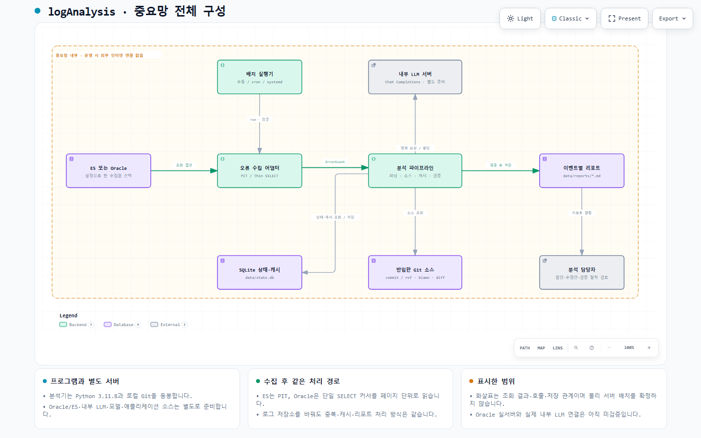
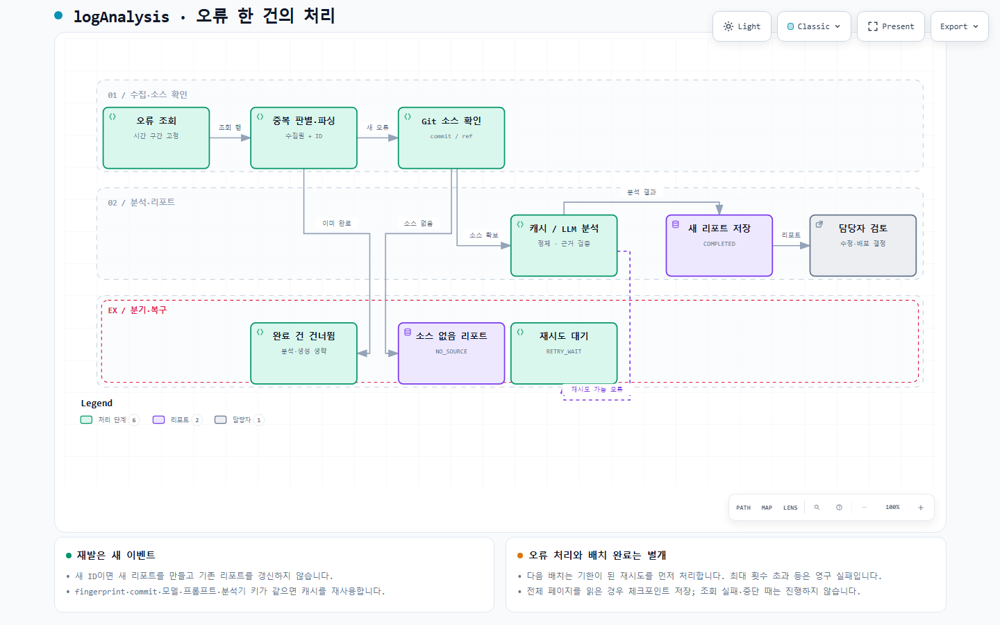
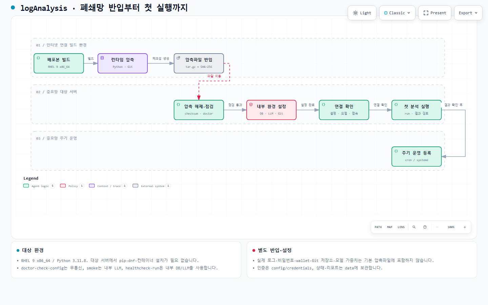

# 그림으로 보는 logAnalysis

현재 0.4.0에는 [로컬 텍스트 파일 입력](LOCAL_FILES.md)이 추가되었습니다.
아래 Archify 도식은 Oracle·ES를 구현한 0.3.0 시점의 도식입니다. 파일 입력의 세부 흐름은
파일 입력 안내를 참고하세요. 수집 이후 Java 파싱·Git·LLM·리포트 흐름은 같습니다.

Java 오류 로그를 읽고, 실제 소스와 함께 분석해 사람이 검토할 리포트를 만드는 도구입니다.
아래 도식은 **2026-09-06 / `codex/important-network` 작업 디렉터리 / 0.3.0** 기준입니다.
Oracle 추가 작업을 포함하며, 이미 공개된 커밋만을 기준으로 생성한 도식은 아닙니다.

[Archify](https://github.com/tt-a1i/archify)의 JSON 스키마·렌더러·검증 도구로 만들었습니다.
GitHub에서는 아래 미리보기를 보고, 확대·검색이 필요하면 HTML 파일을 내려받아 브라우저로 여세요.
HTML은 필요한 스크립트와 스타일을 포함한 단일 파일입니다. 열람에 Node나 Python 설치가 필요 없습니다.
도식·설명은 한국어이며, Archify 고정 메뉴와 HTML 언어 속성은 영어 기본값을 사용합니다.

| 보고 싶은 내용 | 브라우저용 도식 | 수정 가능한 원본 |
|---|---|---|
| 구성요소와 연결 관계 | [전체 구성](diagrams/overview.html) | [Architecture JSON](diagrams/overview.architecture.json) |
| 오류 한 건과 중복·실패 처리 | [처리 흐름](diagrams/event-processing.html) | [Workflow JSON](diagrams/event-processing.workflow.json) |
| 폐쇄망 설치와 첫 실행 | [반입·설치 흐름](diagrams/offline-install.html) | [Workflow JSON](diagrams/offline-install.workflow.json) |

## 1. 전체 구성



한 설정에서 **Elasticsearch 또는 Oracle 중 하나**를 선택합니다. 수집 어댑터는 각 저장소의
행·문서를 공통 `ErrorEvent`로 바꾸고, 이후 분석 파이프라인은 같은 방식으로 처리합니다.

| 구성요소 | 하는 일 | 구현 근거 |
|---|---|---|
| 배치 실행기 | 설정·인증을 읽고 실행 잠금을 획득한 뒤 배치를 한 번 실행 | [cli.py](../src/log_analyzer/cli.py), [run_lock.py](../src/log_analyzer/run_lock.py) |
| ES 수집 어댑터 | PIT와 search_after로 고정 조회 결과를 페이지 단위로 읽기 | [elasticsearch.py](../src/log_analyzer/sources/elasticsearch.py) |
| Oracle 수집 어댑터 | 테이블·뷰 매핑, 바인드 SQL, 단일 Thin SELECT 커서 조회 | [oracle.py](../src/log_analyzer/sources/oracle.py) |
| 분석 파이프라인 | 중복 확인, 파싱, 소스 연결, 캐시·재시도·리포트 조정 | [pipeline.py](../src/log_analyzer/pipeline.py) |
| 로컬 Git | 오류의 commit 우선 조회, 없으면 설정한 ref와 blame·최근 diff 확인 | [git.py](../src/log_analyzer/source_code/git.py) |
| 내부 LLM 연결 | 정제된 Context를 Chat Completions로 보내 분석 결과 받기 | [onprem.py](../src/log_analyzer/analysis/onprem.py) |
| SQLite | 처리 상태·체크포인트·분석 캐시·재시도 일정 보관 | [storage.py](../src/log_analyzer/storage.py) |
| 리포트 | 근거를 검증한 분석 결과를 이벤트별 Markdown으로 저장 | [report.py](../src/log_analyzer/report.py) |

초록색 가로 경로는 수집부터 리포트까지의 주요 연결을 나타냅니다. 보조 화살표는
호출·조회·저장 관계입니다. 반환 흐름을 모두 별도 화살표로 그린 시퀀스 도식은 아닙니다.
실제 스케줄러는 파이프라인 전체를 시작하며, 그림에서는 진입점을 수집 어댑터 쪽에 표시했습니다.

중요망 테두리는 **의도한 통신 범위**입니다. 실제 방화벽·DNS·서버 배치를 탐지한 결과가 아닙니다.
내부 LLM 서버와 로그 DB는 별도로 준비하고, 분석기 서버에는 Python 3.11.8·의존성·Git을
동봉한 실행 파일, 설정, 반입 소스, SQLite와 리포트를 둡니다.

인터넷 환경에서는 NVIDIA NIM·OpenAI도 선택할 수 있지만 이 그림은 `provider="onprem"`을
사용하는 중요망 구성을 보여줍니다. 중요망 실행기는 클라우드 provider를 거부합니다.

## 2. 오류 한 건의 처리



1. 배치가 고정한 시간 구간에서 로그를 읽습니다.
2. `수집원 이름 + 이벤트 ID`로 처리 이력을 확인하고 Java 예외·소스 위치를 파싱합니다.
3. 로그의 commit 또는 설정한 로컬 Git ref에서 관련 소스를 찾습니다.
4. 전송 내용을 정제하고, 조건이 같은 캐시가 있으면 재사용합니다. 없으면 내부 LLM을 호출합니다.
5. 응답·소스 근거를 검증한 뒤 새 이벤트의 리포트와 완료 상태를 저장합니다.
6. 담당자가 리포트를 검토하고 실제 수정·배포 여부를 결정합니다.

| 분기 | 실제 처리 |
|---|---|
| 이미 완료한 이벤트를 재조회 | 분석·리포트를 추가로 만들지 않음 |
| 같은 오류가 새로운 ID로 재발 | 별도 이벤트·리포트 생성; 조건이 같으면 분석 캐시 재사용 |
| 소스를 찾지 못함 | `NO_SOURCE` 리포트 생성; LLM 미호출 |
| 재시도 가능한 분석 오류 | `RETRY_WAIT`; 다음 배치에서 기한이 된 작업을 먼저 재시도 |
| 재시도 한도 초과·복구할 수 없는 데이터 등 | `PERMANENT_FAILURE`; 무한 재시도하지 않음 |
| 원본 조회 실패·실행 중단 | 체크포인트를 진행하지 않아 다음 실행에서 다시 조회 |

캐시 키는 `fingerprint + 실제 Git commit + 모델 + 프롬프트 버전 + 분석기 식별값`입니다.
그림의 **캐시 / LLM 분석**은 이 선택과 검증을 하나의 단계로 묶은 표현입니다.
캐시가 적중한 새 이벤트도 새 리포트를 만들며, 기존 리포트를 갱신하지 않습니다.

체크포인트는 오류 한 건이 아니라 **배치 조회 구간 전체**의 진행 상태입니다.
모든 페이지를 읽으면 종료 시각을 저장합니다. 일부 이벤트가 재시도 대기·영구 실패여도
전체 조회가 끝났다면 체크포인트는 저장될 수 있습니다. 원본 조회가 실패하면 이미 생성한
리포트는 유지되고, 재실행에서 완료 ID를 건너뜁니다.

그림은 대표 흐름을 요약합니다. 영구 실패의 모든 원인이나 재시도 화살표를 펼친 상태 머신은
아닙니다. 자세한 기준은 [중복·재발 처리](DUPLICATE_ERRORS.md), Oracle 고유 조건은
[Oracle 연결 안내](ORACLE.md)를 참고하세요.

## 3. 폐쇄망 반입과 첫 실행



인터넷 연결 환경에서 배포본을 만들고, 완성한 압축파일을 중요망으로 이동합니다.
대상 서버는 **RHEL 9 x86_64 / Python 3.11.8** 기준이며 기본적으로 동봉 런타임을 사용합니다.
파일 반입 화살표는 파일 전달 절차를 뜻하며, 인터넷망과 중요망 사이의 상시 네트워크 연결을
나타내지 않습니다.

압축 해제 이후의 확인 순서는 다음과 같습니다.

```text
체크섬 확인 → 압축 해제 → doctor
→ 내부 DB·LLM·Git·인증 설정
→ check-config → smoke → healthcheck → run
→ 리포트 검토 → cron/systemd 주기 실행 등록
```

`doctor`·`check-config`는 네트워크를 사용하지 않습니다. `smoke`는 합성 오류를 내부 LLM으로
분석하고, `healthcheck`·`run`은 설정한 내부 DB와 LLM에 연결합니다.
비밀번호·wallet·운영 로그·실제 Git 저장소·LLM 모델 가중치는 기본 배포본에 포함하지 않습니다.

실행 명령과 인증 파일 준비는 [폐쇄망 배포 안내](OFFLINE_DEPLOYMENT.md)를 따르세요.
이번 도식은 기존 0.3.0 압축파일 제작 후 추가했습니다. 이미 전달한 압축파일에는 들어 있지
않으며, 필요하면 도식 HTML을 별도로 반입하거나 최신 소스로 배포본을 다시 만듭니다.

## 검증과 유지보수

세 도식은 Archify의 **showcase 검사 9/9, 구성 오류 0·경고 0**을 통과했습니다.
Chrome에서 1440×900, 1600×1000, 1920×1080, 2048×1320의 화면 넘침·가독성을 확인하고,
작은 화면과 큰 화면의 밝은·어두운 테마 이미지를 생성했습니다.
브라우저 검사와 이미지 검토는 실제 Oracle 접속·LLM 품질 검증을 대신하지 않습니다.
Oracle 실서버·실제 내부 LLM 연계는 여전히 미검증입니다.

다이어그램의 원본 SHA-256, HTML SHA-256, 자동 검사와 시각 검토 범위는
[검증 기록](diagrams/verification.json)에 있습니다. 재생성 방법과 사용한 Archify 버전·라이선스는
[도식 파일 안내](diagrams/README.md)에 기록했습니다.
